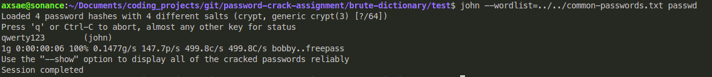

Tool Options
- jack the ripper
- hyrda
- cain & abel (windows)
- ophcrack
- hashcat (gpu)

### jack-the-ripper tool.

[john-the-ripper](https://www.varonis.com/blog/john-the-ripper)


recommended steps:-
`umask 077` only user has read/write/ex perms
`brute-dictionary/test` has been umasked

>/etc/passwd file aims at user account details while /etc/shadow aims at the user's password details.

running john creates
`~/.john` bruh.

`john mypasswd`
`john --show mypasswd`


let's try and crack a `zip/rar` file.

password is `qwerty`

this hashes it
`zip -e ccat-command.zip ccat-1.1.0/`

we need to get password hash of the zip file.

`zip2john` needed for extracting hash from the file.


nmv creating fake user lessgo
```
john
qwerty123
```
```
$6$5A57gmANeAsBUDfM$lR8n5kxYv4fIFbu0TRzkDcYB7Laq/hIKvJ2bh.07w6J7R5dEQd2kFpCzM7QrCM8wTskZ5jf1RGX4r/GQOhjGI.:19086:0:99999:7:::
```

john's hash

