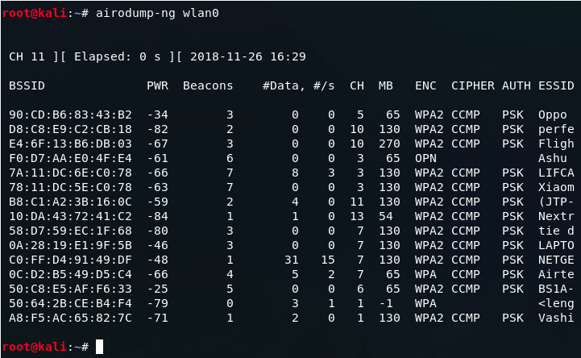

[assessing-wireless-networks](https://www.rapid7.com/blog/post/2013/05/22/easily-assessing-wireless-networks-with-kali-linux/)

```airmon-ng start wlan0```
```airodump-ng mon0```


**note** we have to however use a compatible network card driver

`ESSID` shows the network name.
`AUTH` field displays the security of each network.

you can then use `fern-wifi-cracker` to test these networks.